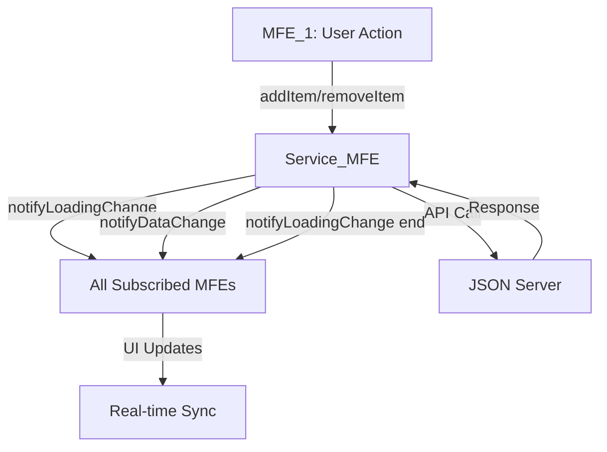

# 🏗️ Microfrontend Architecture - Technical Guide

> Complete technical documentation for the event-driven microfrontend system

## 🚀 Quick Commands

```bash
# Essential commands
./start_all_mfe.sh --clean --check  # Start all with health check
./check_mfe_endpoints.sh --detailed # Detailed health report  
./stop_all_mfe.sh --force          # Force stop all services
```

## 🏛️ System Architecture

### Services Overview
| Service | Port | Technology | Purpose |
|---------|------|------------|---------|
| 🌐 Container | 3000 | React + Module Federation | App orchestrator, status dashboard |
| 📦 MFE_1 | 3001 | React + Styled Components | Items CRUD operations |
| 🔍 MFE_2 | 3002 | React + Advanced UI | Items filtering with loading awareness |
| 🔧 Service_MFE | 3003 | React + Event System | Central API layer and event hub |
| 👥 Users_MFE | 3005 | React + Modern UI | Users management with error boundaries |
| 🏪 Store_MFE | 3004 | React + RTK | Redux state management |
| 🗄️ JSON Server | 4000 | Express + CORS | Mock REST API with delay simulation |

## 🔄 Event-Driven Architecture

### Core Event System
```typescript
// Global event listeners (service_mfe/src/mount.tsx)
const dataChangeListeners = {
  items: new Set<(data: any[]) => void>(),
  users: new Set<(data: any[]) => void>(),
};

const loadingChangeListeners = {
  items: new Set<(isLoading: boolean, operation?: string) => void>(),
  users: new Set<(isLoading: boolean, operation?: string) => void>(),
};
```

### Service MFE API
```typescript
interface ServiceMfeApi {
  // CRUD Operations
  fetchItems(): Promise<any[]>
  addItem(item: any): Promise<any[]>
  removeItem(id: string): Promise<any[]>
  filterItems(query: string): Promise<any[]>
  
  fetchUsers(): Promise<any[]>
  addUser(user: any): Promise<any[]>
  removeUser(id: string): Promise<any[]>
  filterUsers(query: string): Promise<any[]>
  
  // Event System
  onDataChange<T>(dataType: 'items'|'users', callback: (data: T[]) => void): () => void
  onLoadingChange(dataType: 'items'|'users', callback: (loading: boolean, op?: string) => void): () => void
  
  // State Access
  loaders: { [operation: string]: boolean }
  errors: { [operation: string]: string | null }
  unmount(): void
}
```

### Event Flow


## 🎨 Design System & UI

### Shared Theme Architecture
```typescript
// theme.ts (shared across MFEs)
export const theme = {
  colors: {
    primary: '#764ba2',    // MFE_1 (purple)
    info: '#17a2b8',       // MFE_2 (blue)  
    success: '#28a745',    // Users_MFE (green)
    warning: '#ffc107',
    danger: '#dc3545',
  },
  spacing: { xs: '4px', sm: '8px', md: '16px', lg: '24px', xl: '32px' },
  typography: { fontFamily: 'system-ui', fontSize: {...}, fontWeight: {...} },
  borderRadius: { sm: '4px', md: '8px', lg: '12px' },
  shadows: { sm: '0 2px 4px rgba(0,0,0,0.1)', md: '...', lg: '...' },
  transitions: { fast: '0.15s ease', normal: '0.3s ease' }
}
```

### Styled Components Examples
```typescript
// MFE_1 Components
export const MfeContainer = styled.div`
  border: 2px solid ${theme.colors.primary};
  border-radius: ${theme.borderRadius.md};
  padding: ${theme.spacing.md};
  background: ${theme.colors.white};
  box-shadow: ${theme.shadows.md};
`;

export const Button = styled.button<{variant?: 'primary'|'danger'}>`
  background: ${props => props.variant === 'danger' 
    ? theme.colors.danger 
    : theme.colors.primary};
  transition: all ${theme.transitions.fast};
  &:hover { transform: translateY(-1px); }
`;
```

### CSS Modules (Container)
```css
/* theme.module.css */
:root {
  --primary-color: #764ba2;
  --success-color: #28a745;
  --spacing-md: 16px;
  --border-radius-md: 8px;
  /* ... */
}

.statusCard {
  background: linear-gradient(135deg, var(--primary-color), var(--secondary-color));
  border-radius: var(--border-radius-md);
  padding: var(--spacing-xl);
  transition: all 0.3s ease;
}
```

## 🔧 Custom Hooks Architecture

### useItems (MFE_1)
```typescript
export const useItems = ({ serviceApi }) => {
  const [items, setItems] = useState([]);
  const [newItem, setNewItem] = useState("");

  // Subscribe to data changes
  useEffect(() => {
    if (!serviceApi?.onDataChange) return;
    const unsubscribe = serviceApi.onDataChange('items', setItems);
    return unsubscribe;
  }, [serviceApi]);

  const handleAdd = useCallback(async () => {
    if (!newItem.trim()) return;
    await serviceApi.addItem({ name: newItem.trim() });
    setNewItem("");
  }, [newItem, serviceApi]);

  return { items, newItem, setNewItem, handleAdd, handleRemove, loaders, errors };
};
```

### useItemsFilter (MFE_2)
```typescript
export const useItemsFilter = ({ serviceApi }) => {
  const [externalLoading, setExternalLoading] = useState(false);
  const [loadingOperation, setLoadingOperation] = useState("");

  // Subscribe to loading states from other MFEs
  useEffect(() => {
    if (!serviceApi?.onLoadingChange) return;
    const unsubscribe = serviceApi.onLoadingChange('items', (isLoading, operation) => {
      setExternalLoading(isLoading);
      setLoadingOperation(operation || "");
    });
    return unsubscribe;
  }, [serviceApi]);

  // Loading messages
  const getLoadingMessage = (operation) => {
    switch (operation) {
      case 'addItem': return '➕ Adding new item...';
      case 'removeItem': return '🗑️ Removing item...';
      case 'dataSync': return '🔄 Syncing data...';
      default: return '🔄 Another MFE is performing operations...';
    }
  };

  return { externalLoading, loadingOperation, getLoadingMessage, ... };
};
```

## 🛠️ Development Workflow

### Enhanced Shell Scripts

#### start_all_mfe.sh Features
- ✅ **Argument parsing**: `--clean`, `--fast`, `--check`
- ✅ **Colored output**: Visual feedback with emojis
- ✅ **Error handling**: `set -e` for fail-fast
- ✅ **PID tracking**: Store PIDs for reliable cleanup
- ✅ **Optimal startup order**: Dependencies first, container last
- ✅ **Automated health check**: Optional service verification

#### stop_all_mfe.sh Features  
- ✅ **Graceful shutdown**: SIGTERM before SIGKILL
- ✅ **PID-based cleanup**: More reliable than process matching
- ✅ **Port cleanup**: Kill any process using our ports
- ✅ **Force option**: `--force` for immediate termination

#### check_mfe_endpoints.sh Features
- ✅ **Comprehensive health check**: All services + endpoints
- ✅ **Response time tracking**: Performance monitoring
- ✅ **JSON output**: `--json` for automation/CI
- ✅ **Detailed mode**: `--detailed` for debugging

### Log Management
```bash
# Structured logging
logs/
├── mfe_1.log          # MFE_1 webpack output
├── mfe_2.log          # MFE_2 webpack output  
├── service_mfe.log    # Service layer logs
├── users_mfe.log      # Users MFE logs
├── store_mfe.log      # Redux store logs
├── container.log      # Main app logs
└── mock_json_server.log # API server logs

# PID tracking
logs/
├── mfe_1.pid
├── service_mfe.pid
└── ...
```

## 🔍 Performance Optimizations

### Smart Delay Middleware (JSON Server)
```javascript
// mock_json_server/delay.js
module.exports = (req, res, next) => {
  const shouldDelay = (
    req.method === 'GET' && 
    req.path === '/items' && 
    !req.query.q // Don't delay filter operations
  );
  
  if (shouldDelay) {
    setTimeout(next, 2000); // Simulate slow initial load
  } else {
    next(); // Fast operations (add/remove/filter)
  }
};
```

### Error Handling & Recovery
```typescript
// service_mfe/src/mount.tsx - Robust error handling
const addItem = async (item: any) => {
  try {
    notifyLoadingChange('items', true, 'addItem');
    const items = await addItemHandler(item);
    await notifyDataChange('items', fetchItemsHandler);
    return items ?? [];
  } catch (error) {
    console.error('Error in addItem:', error);
    throw error;
  } finally {
    notifyLoadingChange('items', false, 'addItem'); // Always cleanup
  }
};
```

## 🏆 Architecture Benefits

### ✅ **Event-Driven Communication**
- **Loose coupling**: MFEs don't import each other directly  
- **Real-time sync**: Changes propagate automatically
- **Type safety**: TypeScript event interfaces
- **Memory management**: Proper subscription cleanup

### ✅ **Loading State Management**
- **Cross-MFE awareness**: MFE_2 shows when MFE_1 is working
- **Operation-specific feedback**: Different messages per action
- **Consistent UX**: Users always know what's happening
- **Error recovery**: Robust error boundaries

### ✅ **Modern UI Architecture**  
- **Design system**: Shared theme across all MFEs
- **Styled Components**: CSS-in-JS with theme support
- **CSS Modules**: Scoped styles for container
- **Responsive design**: Mobile-first approach
- **Accessibility**: WCAG compliance

### ✅ **Developer Experience**
- **TypeScript**: Full type safety across MFEs
- **Hot reload**: Fast development cycle
- **Source maps**: Easy debugging
- **Automated scripts**: One-command startup/shutdown
- **Comprehensive logging**: Debug any issue quickly

## 🧪 Testing & Monitoring

### Health Monitoring
```bash
# Basic health check
./check_mfe_endpoints.sh

# Detailed diagnostics  
./check_mfe_endpoints.sh --detailed

# JSON for automation
./check_mfe_endpoints.sh --json | jq '.[] | select(.healthy == false)'
```

### Service Status Codes
- **200**: Healthy and operational
- **000**: Service unreachable (not started)  
- **4xx/5xx**: Service error (check logs)

## 📊 Project Metrics

- **7 Services**: Orchestrated microfrontend ecosystem
- **5 MFEs**: Independent, deployable components  
- **2 Event Types**: Data changes + Loading states
- **3 UI Technologies**: Styled Components + CSS Modules + RTK
- **100% TypeScript**: Full type safety
- **Mobile-first**: Responsive design system

---

*This architecture demonstrates enterprise-level microfrontend patterns with modern React, TypeScript, and event-driven design.*